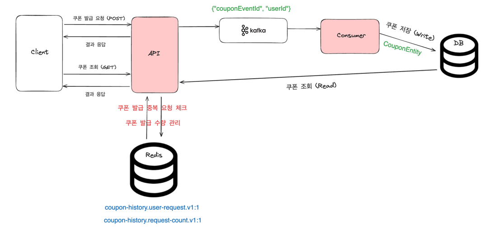
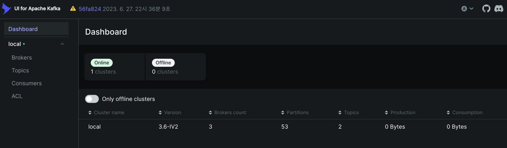
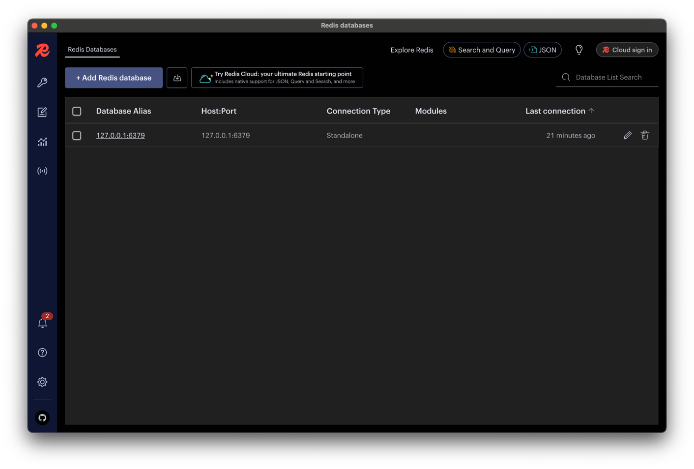
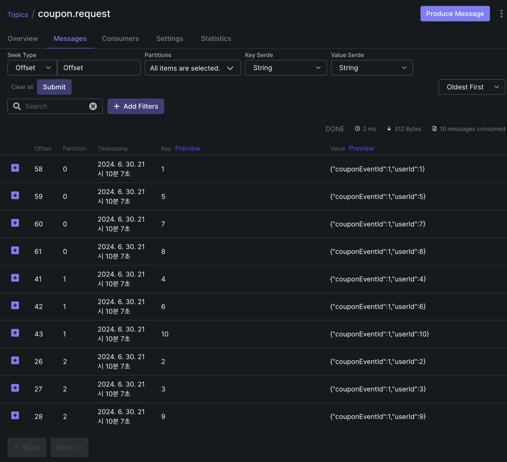
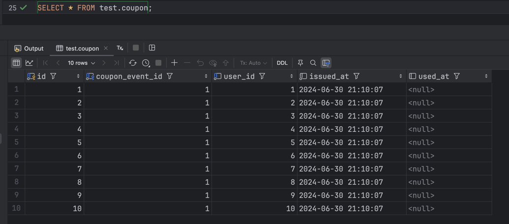
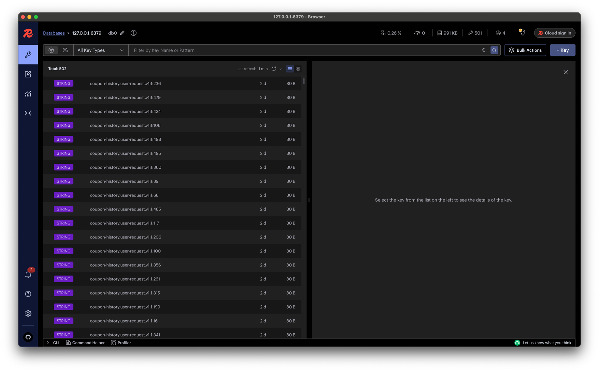

## 선착순 쿠폰 발행 이벤트

### 요구사항
- 유저는 쿠폰(Coupon) 발급 요청을 할 수 있다.
- 발급 가능한 쿠폰 수량은 인당 1개이며, 전체 수량은 n개로 정해져 있다. (선착순 n명)
- 순간적인 대량 트래픽이 발생할 것이고, 요청량에 상관없이 latency 문제는 없어야 한다.
- 유저가 쿠폰 발급 요청을 하면, 그 요청이 선착순 안에 들었는가에 대한 여부를 응답에 포함해야 한다.
- 쿠폰 발급 내역을 저장할 DB는, 이미 전사에서 사용하고 있는 인프라를 활용해야 한다.


### 프로젝트 아키텍쳐


- 순간적인 대량의 트래픽으로 인해 유저의 쿠폰 발급 요청 직후 DB 에 Write 하는 작업이 부하가 발생할 수 있고 그로 인해 응답이 지연되거나, 데이터 유실, 부분적인 실패 상황 등이 발생할 수 있습니다.
- 위의 문제로 인해 메시지 큐를 도입하여, API 서버 입장에서는 쿠폰 잔여량이 존재한다면, 카프카에 메시지만 발행하고, 클라이언트에 빠른 응답을 내려줄 수 있습니다.
- 유저가 선착순에 들었는지에 대한 가벼운 로직을 수행 후 응답을 빠르게 내려주고, 쿠폰 발급과 관련한 로직은 카프카 서비스에 위임하여 순차적으로 처리합니다.
- 쿠폰의 잔여량은 원격의 저장소(Redis)를 사용하여 관리합니다.

### 프로젝트 실행

```shell
git clone https://github.com/JuHyun419/coupon-event
cd coupon-event
docker compose up -d
./gradlew build
./gradlew bootRun
```

#### Kafka (kafka-ui)
http://localhost:8089/

- 토픽명: coupon.request 으로 생성 


#### Redis (Redis Insight)



### 테스트
- [coupon_issue_request.sh](coupon_issue_request.sh) 파일을 실행하여 테스트합니다.
```shell
./coupon_issue_request.sh
```

#### 발급 성공한 유저 데이터(Kafka)


#### 발급된 쿠폰 데이터 (MySQL)


#### 발급 요청 데이터 (Redis)

